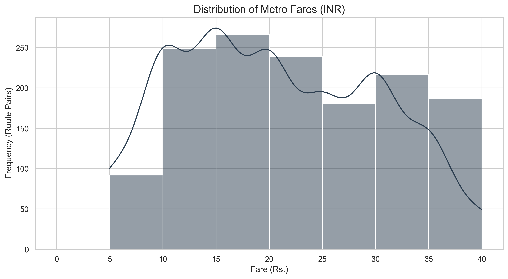
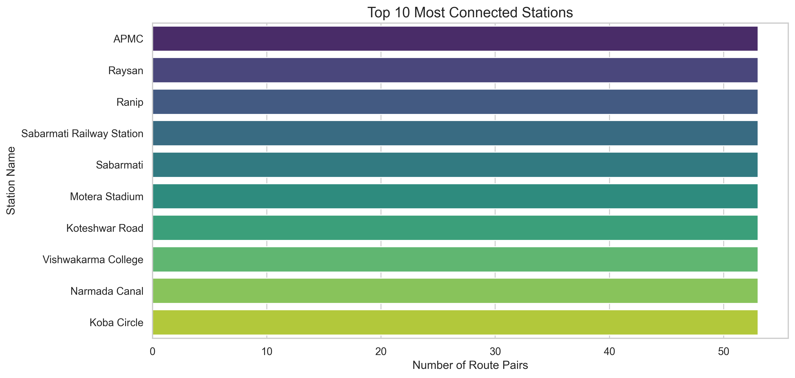
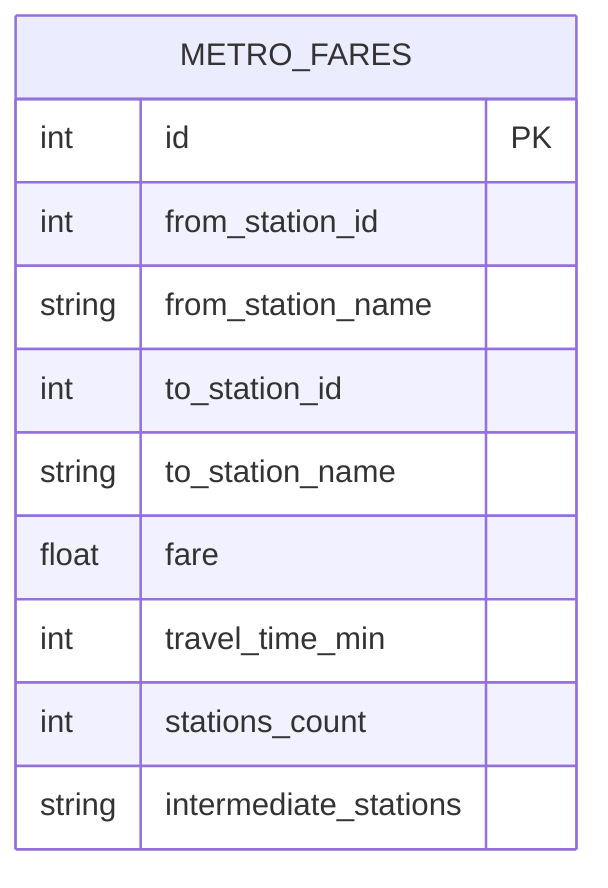

# 🚇 Ahmedabad Metro ETL Pipeline

[](https://www.python.org/downloads/release/python-390/)
[](https://www.selenium.dev/)
[](https://opensource.org/licenses/MIT)

A high-performance, automated ETL (Extract, Transform, Load) pipeline designed to scrape, clean, and analyze route and fare data from the [Official Ahmedabad Metro Portal](https://www.gujaratmetrorail.com/ahmedabad/route-and-fares/).

## 📌 Project Overview

This project automates the extraction of metro transit data to provide insights into fare structures, travel times, and network connectivity. It handles the dynamic nature of the metro website using Selenium for browser automation and stores the structured data in a relational SQLite database.

### Key Features
- **Dynamic Scraping**: Uses Selenium to handle JavaScript-heavy content and asynchronous fare loading.
- **Symmetric Optimization**: Smartly scrapes only unique station pairs (A → B) to reduce execution time by 50%, while allowing bi-directional querying.
- **Data Integrity**: Automated completeness checks ensure all 1,431 possible station combinations are accounted for.
- **Robust ETL**: Dedicated cleaning modules for fares, time strings, and station lists.
- **Visualization**: Built-in analytics to generate fare distribution and connectivity insights.

---

## 📊 Data Insights & Visualizations

### 1. Fare Distribution
The chart below shows the frequency of different fare brackets across the entire 54-station network.


### 2. Travel Time vs. Fare Correlation
Analyzing the relationship between time spent in transit and the cost of the journey.


### 3. Top Connected Stations
The hubs of the Ahmedabad Metro network, identified by their frequency in route records.


---

## 🏗️ System Architecture

### Entity Relationship (ER) Diagram
The data model is designed for simplicity and efficient bi-directional querying.



### Data Flow
1. **Extraction**: Selenium WebDriver automates station selection on the Gujarat Metro portal.
2. **Transformation**: `utils.py` cleans text data, converts currency strings to floats, and parses "X Min" to integers.
3. **Loading**: Structured data is inserted into `metro_data.db` using SQLite with `INSERT OR REPLACE` logic for idempotency.

---

## 🛠️ Technical Stack
- **Core**: Python 3.9
- **Automation**: Selenium WebDriver, Webdriver-Manager
- **Parsing**: BeautifulSoup4, lxml
- **Data Handling**: Pandas, SQLite3
- **Visualization**: Matplotlib, Seaborn

---

## 🚀 Execution Guide

### Prerequisites
- Chrome Browser installed
- Python 3.9+

### Installation
```bash
# Clone the repository
git clone https://github.com/Carnage08/Ahamdabad_metro-_ETL_Pipeline.git
cd Ahamdabad_metro-_ETL_Pipeline

# Set up virtual environment
python3 -m venv venv
source venv/bin/activate

# Install dependencies
pip install -r requirements.txt
```

### Running the Pipeline
```bash
# Execute full scraping (54 stations)
python main.py

# Verify database completeness
python check_db_completeness.py

# Export data to CSV
python export_to_csv.py

# Generate/Update Visualizations
python generate_graphs.py
```

---

## 📜 License
Distributed under the MIT License. See `LICENSE` for more information.

---
**Developed by [Arjun Yadav](https://github.com/Carnage08)**
